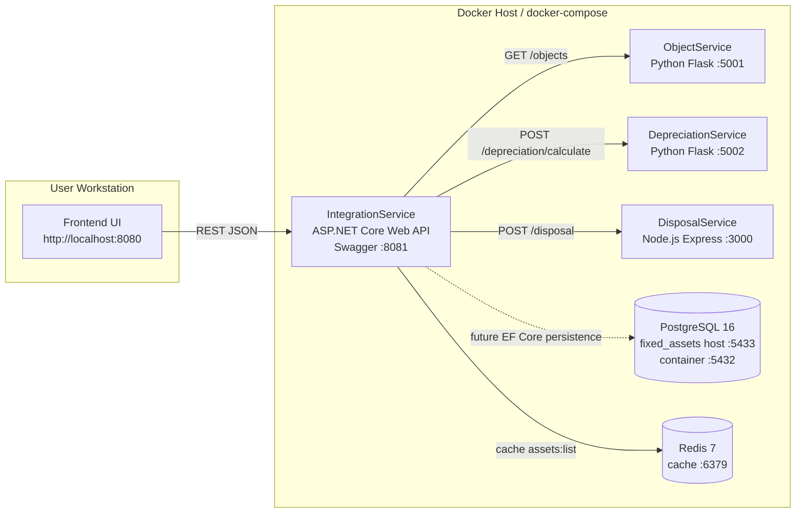

# UML Deployment Diagram

Диаграмма показывает развертывание демо-стенда в Docker Compose. Все прикладные контейнеры находятся в одной compose-сети и общаются по DNS-именам сервисов.

## Deployment Notes

| Узел | Роль |
|---|---|
| Frontend UI | Демо-интерфейс оператора учета ОС |
| IntegrationService | API gateway/orchestrator, единая точка входа для UI |
| ObjectService | Источник карточек ОС |
| DepreciationService | Расчет годовой амортизации |
| DisposalService | Выполнение операции списания |
| PostgreSQL | Транзакционное хранилище данных |
| Redis | Быстрый кэш для справочных и часто читаемых данных |
