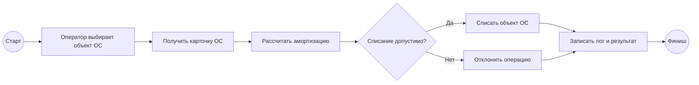
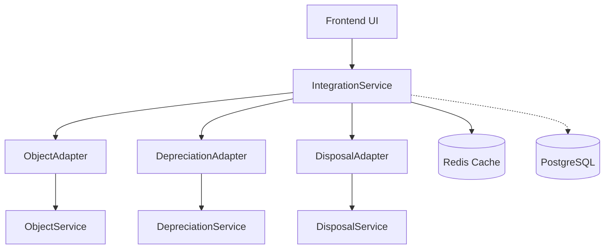

# План презентации защиты

## Слайд 1. Титул

**Fixed Assets System**  
Интеграционная система учета основных средств на микросервисной архитектуре.

Ключевые технологии: C#, ASP.NET Core, Python Flask, Node.js Express, PostgreSQL, Redis, Docker, GitHub Actions, Serilog, Polly, Swagger/OpenAPI.

## Слайд 2. BPMN

Акцент: BPMN отражает бизнес-процесс, а не техническую топологию.

## Слайд 3. UML компонентов

Акцент: адаптеры изолируют IntegrationService от конкретных downstream API.

## Слайд 4. Архитектура + Docker + GitHub Actions

- Docker Compose поднимает frontend, integration-service, три доменных сервиса, PostgreSQL и Redis.
- GitHub Actions выполняет сборку, установку зависимостей и smoke-проверку compose-стенда.
- IntegrationService является единой точкой входа для UI и Swagger.

## Слайд 5. Демонстрация UI

- Открыть `http://localhost:8080`.
- Показать загрузку объектов ОС через `GET /api/assets`.
- Нажать `Списать`.
- Показать результат: годовая амортизация и статус списания.

## Слайд 6. Тестирование

- Unit-тесты адаптеров.
- Integration-тесты полного потока.
- Playwright E2E для UI.
- Smoke-проверки Docker Compose.
- Swagger как интерактивный контракт API.

## Слайд 7. Polly + Redis + оптимизация

- Redis снижает нагрузку на ObjectService.
- Polly retry компенсирует временные сетевые ошибки.
- Circuit breaker защищает систему от каскадных отказов.
- Serilog дает traceability через correlation id.

## Слайд 8. Заключение

- Реализована микросервисная интеграционная архитектура.
- Сервисы изолированы и развертываются контейнерно.
- Документация, Swagger и demo script позволяют воспроизвести защиту.
- Архитектура готова к расширению EF Core, Saga persistence и асинхронной интеграции через брокер сообщений.
