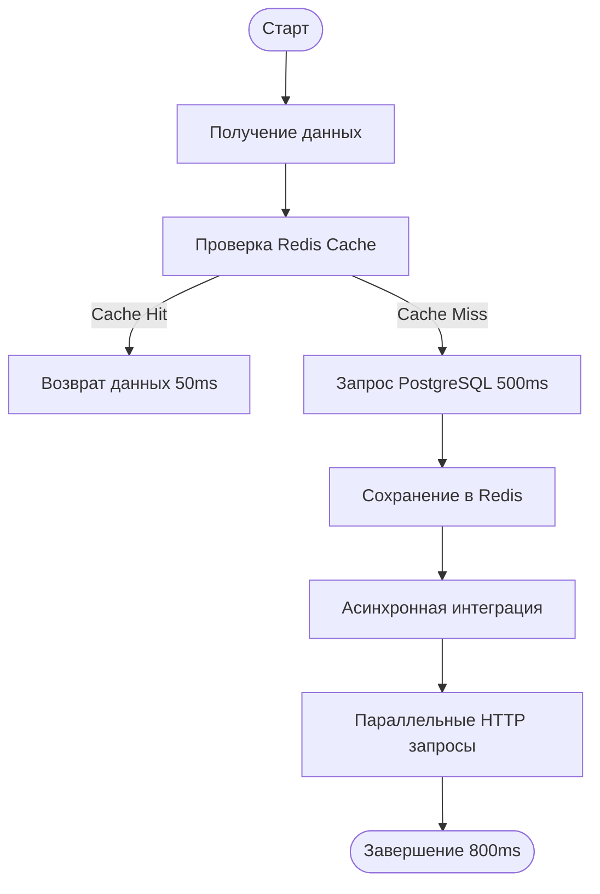

# UML Activity Diagram



---

# Добавь Redis в docker-compose

```yaml id="w6j9pc"
redis:
  image: redis:7
  ports:
    - "6379:6379"
```

# NuGet пакеты
```bash
dotnet add package Microsoft.Extensions.Caching.StackExchangeRedis
dotnet add package BenchmarkDotNet
```